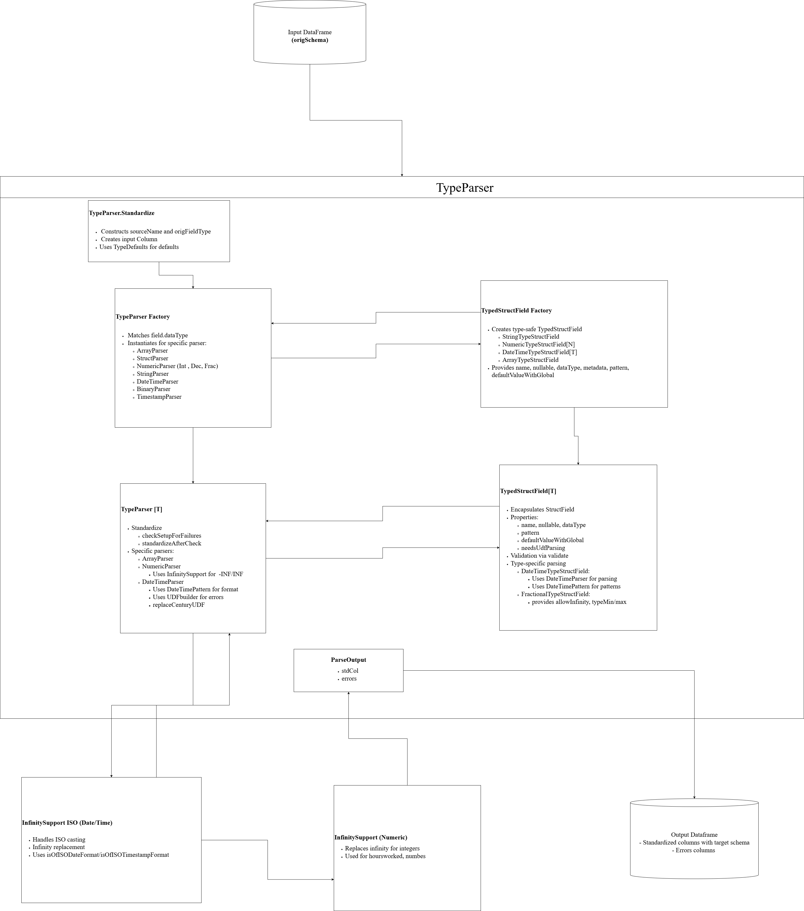

# Context

The current support for infinity values in the Standardization library, needs the infinity values to have the same pattern as the input values. For example, if the input values have pattern yyyy-MM-dd, then the infinity values need to be specified as e.g. 1000-01-01 or 9999-01-01.

This results in a problem when patterns like yyMMdd are used, due to truncation dates such as 2010/01/01 or 2000/01/01  because of the leading zeros they can't be interpreted leading to standardizaton error.

# Solution design

As  TypeParser (it's inner classes and methods), first replaces the infinity symbol with infinity value and only then converts to timestamp/date using the provided pattern. The solution will  defer the replacement based on what pattern the infinity value follows.

TypeParser is to provide the InfinitySupport with the column and the converting function  where InfinitySupport now decides if infinity value is encoded by provided pattern or ISO pattern for both positive and negative infinity , where in case no infinity defined there is no transformation else if input column === infinity symbol use the infinity_value converted using ISO pattern and  return the converting function result with original column.
  
# Outcome

InfinitySupport replaced with class providing unified `replaceInfinitySymbols` method with a conversion function, which is extended by InfinitySupportIso which implements the date/time algorithm to parse infinity values matching the input pattern using `defaultInfinityValueInjection` else use `isoCast` for ISO-formatted infinity values using `isOfISODateFormat` and `isOfISOTimestampFormat` to detect SO formats

TypeParser continues orchestrating standardisation and delegating Parsers for source to target types.

